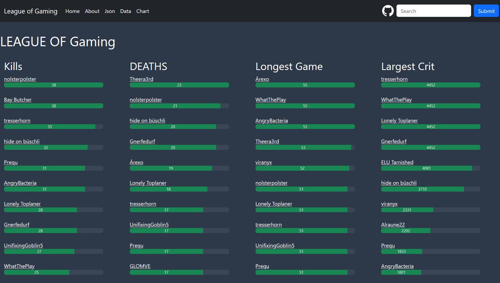
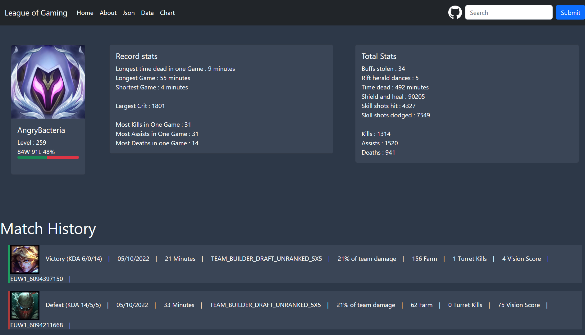

# THIS IS A WORK IN PROGRESS
# League of Gaming Website

## Reasons
This is a React-JS and Spring Boot based website.
Me and my friends like to play the popular Game
League of Legends but we always missed some sort of
website to compare our ingame stats with each other.
This void is filled with this Website.

## How it works (short)
The Frontend needs [this Backend](https://github.com/AngryBacteria/LeagueOfGaming_API) to work properly.
The Backend is needed for the Data of all the Players registered on the Website. 
Most data is then loaded directly from the api with some parts
of it coming from the riot datadragon-api directly

## Demo
https://league.angrybacteria.ch/

## Pictures

